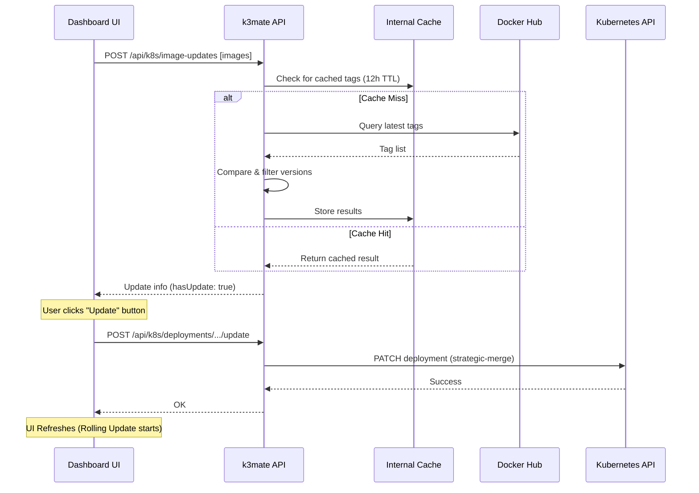

# k3mate: Personalized Kubernetes Dashboard

**A lightweight, secure web interface for managing k3s clusters and workloads.**

k3mate is a Next.js-powered dashboard designed to provide a clean, mobile-responsive view of your Kubernetes infrastructure. It focuses on the essentials: node health, workload status, and real-time pod logs.

## 🚀 Key Features

-   **Cluster Overview**: Real-time visualization of node health, resource pressure, and k8s versioning.
-   **Workload Management**: Live list of Deployments, Pods, and Namespaces.
-   **Interactive Workload Updates**: One-click updates for container images when newer versions are detected in the registry (Docker Hub).
-   **Terminal Logs**: Stream logs directly from pods within the web interface.
-   **Pod Lifecycle**: Quick actions to restart or delete pods for troubleshooting.
-   **Resource Metrics**: Real-time CPU and Memory usage tracking for nodes and pods.
-   **Secure Authentication**: Password-protected dashboard with session-based access to the Kubernetes control plane.

## 🏗 Tech Stack

-   **Framework**: Next.js 15+ (App Router)
-   **Language**: TypeScript
-   **API Client**: `@kubernetes/client-node`
-   **Styling**: TailwindCSS & Radix UI / Shadcn
-   **Testing**: Vitest & React Testing Library

## 📂 Project Structure

-   **`src/app/`**: Next.js App Router pages and API routes.
-   **`src/components/`**: Modular UI components (Dashboard, Workloads, Events).
-   **`src/lib/`**: Core logic (K8s API client factory, Auth logic).
-   **`tests/`**: Comprehensive API and component test suite.

## 🛠 Getting Started

### Prerequisites
-   A running k3s or Kubernetes cluster.
-   A valid `KUBECONFIG` file.

#### Environment Variables
Create a `.env.local` file in the root:
```bash
# Path to your kubeconfig file (required)
KUBECONFIG=/path/to/your/kubeconfig.yaml

# Secret for session encryption (required, 32+ chars)
SESSION_SECRET=your_random_32_char_secret_here

# Optional: Set a password to protect the dashboard
# DASHBOARD_PASSWORD=your_secure_password
```

#### k3s Specifics
If running on a k3s node, you can often find your kubeconfig at `/etc/rancher/k3s/k3s.yaml`. Ensure the `server` field in that file points to the correct IP if accessing from outside the node.

### Development
```bash
npm install
npm run dev
```

### 🐳 Deployment (Docker)
The easiest way to deploy `k3mate` is using Docker Compose.

1.  **Configure environment**:
    ```bash
    export SESSION_SECRET=$(openssl rand -hex 32)
    export KUBECONFIG_HOST_PATH=~/.kube/config
    ```
2.  **Start the container**:
    ```bash
    docker-compose up -d
    ```
    The dashboard will be available at `http://localhost:3000`.

### 🛠 Production Build
For manual production deployments:
```bash
npm run build
npm start
```

## 📖 Documentation
- **[Technical API Reference](docs/API.md)**: Detailed documentation of all internal API endpoints.
- **[Contributing Guide](CONTRIBUTING.md)**: How to help improve k3mate.
- **[License](LICENSE)**: MIT License.
- **[Architecture & Security](CLAUDE.md)**: Project-specific rules and security guidelines.

---

## 🛠 Internal Architecture & API

This section provides a technical overview of the `k3mate` internal API and its integration with the Kubernetes control plane.

### Core Component: `Kubernetes API Client` (src/lib/k8s-client.ts)

The client factory provides a centralized way to initialize and retrieve typed Kubernetes API clients using the `@kubernetes/client-node` library.

- **`getKubeConfig()`**: A singleton factory for the `KubeConfig` object. Requires the `KUBECONFIG` environment variable.
- **`getCoreV1Api()`**: Returns the `CoreV1Api` for cluster-level resources (Nodes, Pods, Namespaces).
- **`getAppsV1Api()`**: Returns the `AppsV1Api` for higher-level workloads (Deployments).

### Server-Side API Routes (src/app/api/)

All routes are implemented as standard Next.js Route Handlers.

- **Workload API (`/api/k8s/deployments/`)**: Lists all deployments in the cluster.
- **Pods API (`/api/k8s/pods/[namespace]/[name]/`)**:
    - `logs/route.ts`: Streams real-time pod logs using the `readNamespacedPodLog` client method.
    - `restart/route.ts`: Triggers a pod restart by deleting the pod entity.

### Component Architecture (src/components/)

- **Dashboard**: `ClusterOverview.tsx` manages the primary health indicators.
- **Workloads**: `DeploymentList.tsx` and `PodList.tsx` use React hooks to fetch data from the server-side API routes.
- **Layout**: `Shell.tsx` provides the responsive container and navigation.

### 🔄 Workload Update Flow

The following diagram illustrates how k3mate detects and applies image updates:


